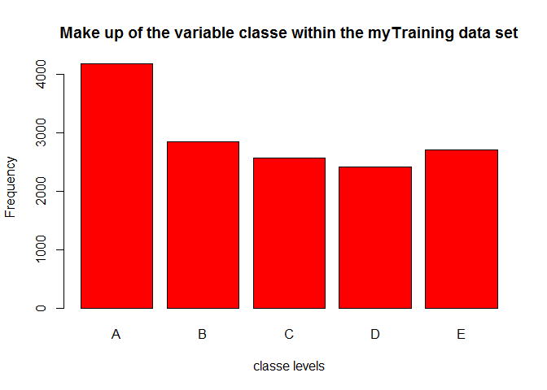

Background
==========

Using devices such as Jawbone Up, Nike FuelBand, and Fitbit it is now
possible to collect a large amount of data about personal activity
relatively inexpensively. These type of devices are part of the
quantified self movement - a group of enthusiasts who take measurements
about themselves regularly to improve their health, to find patterns in
their behavior, or because they are tech geeks. One thing that people
regularly do is quantify how much of a particular activity they do, but
they rarely quantify how well they do it. In this project, your goal
will be to use data from accelerometers on the belt, forearm, arm, and
dumbell of 6 participants. They were asked to perform barbell lifts
correctly and incorrectly in 5 different ways. More information is
available from the website here:
<http://web.archive.org/web/20161224072740/http:/groupware.les.inf.puc-rio.br/har>
(see the section on the Weight Lifting Exercise Dataset).

Data
====

The training data for this project are available here:

<https://d396qusza40orc.cloudfront.net/predmachlearn/pml-training.csv>

The test data are available here:

<https://d396qusza40orc.cloudfront.net/predmachlearn/pml-testing.csv>

The data for this project come from this source:
<http://web.archive.org/web/20161224072740/http:/groupware.les.inf.puc-rio.br/har>.

Aim of the project
==================

The goal of your project is to predict the manner in which they did the
exercise. This is the "classe" variable in the training set. You may use
any of the other variables to predict with. You should create a report
describing how you built your model, how you used cross validation, what
you think the expected out of sample error is, and why you made the
choices you did. You will also use your prediction model to predict 20
different test cases.

Analysis
========

Read and manipulate the data
----------------------------

First install the packages required for the analysis.

    library(lattice); library(ggplot2); library(caret); library(randomForest); library(rpart); library(rpart.plot);

    ## Warning: package 'caret' was built under R version 3.4.4

    ## Warning: package 'randomForest' was built under R version 3.4.4

    ## randomForest 4.6-14

    ## Type rfNews() to see new features/changes/bug fixes.

    ## 
    ## Attaching package: 'randomForest'

    ## The following object is masked from 'package:ggplot2':
    ## 
    ##     margin

    ## Warning: package 'rpart' was built under R version 3.4.4

    ## Warning: package 'rpart.plot' was built under R version 3.4.4

Read the training and test data into memory:

    trainUrl <- "http://d396qusza40orc.cloudfront.net/predmachlearn/pml-training.csv"
    training <- read.csv(url(trainUrl), na.strings=c("NA","#DIV/0!",""))

    testUrl <- "http://d396qusza40orc.cloudfront.net/predmachlearn/pml-testing.csv"
    testing <- read.csv(url(testUrl), na.strings=c("NA","#DIV/0!",""))

We then clean the data by deleting all columns with missing values and
deleting the first 7 columns which are irrelevant to the current
project.

    training<-training[,colSums(is.na(training)) == 0]
    testing <-testing[,colSums(is.na(testing)) == 0]

    training <-training[,-c(1:7)]
    testing <-testing[,-c(1:7)]

We can then partition the data for cross validation purposes - 75%
training, 25% testing. We set the seed to ensure reproducability.

    set.seed(1234)
    inTrain <- createDataPartition(y=training$classe, p=0.75, list=FALSE)
    myTraining <- training[inTrain, ]; myTesting <- training[-inTrain, ]
    dim(myTraining); dim(myTesting)

    ## [1] 14718    53

    ## [1] 4904   53

The plot below shows the make up of the classe variable within the
'myTraining' data set.

    plot(myTraining$classe, col="red", main="Make up of the variable classe within the myTraining data set", xlab="classe levels", ylab="Frequency")

Most of data is of level A with the remaining four levels at a similar
frequency.

Prediction Model 1: Decision Tree
---------------------------------

We'll first attempt to fit a decision tree algorithm to the training
set.

    model1 <- rpart(classe ~ ., data=myTraining, method="class")
    prediction1 <- predict(model1, myTesting, type = "class")
    rpart.plot(model1, main="Decision Tree", extra=102, under=TRUE, faclen=0)

Results of the prediction can be tested on the myTesting data set.

    confusionMatrix(prediction1, myTesting$classe)

    ## Confusion Matrix and Statistics
    ## 
    ##           Reference
    ## Prediction    A    B    C    D    E
    ##          A 1235  157   16   50   20
    ##          B   55  568   73   80  102
    ##          C   44  125  690  118  116
    ##          D   41   64   50  508   38
    ##          E   20   35   26   48  625
    ## 
    ## Overall Statistics
    ##                                           
    ##                Accuracy : 0.7394          
    ##                  95% CI : (0.7269, 0.7516)
    ##     No Information Rate : 0.2845          
    ##     P-Value [Acc > NIR] : < 2.2e-16       
    ##                                           
    ##                   Kappa : 0.6697          
    ##  Mcnemar's Test P-Value : < 2.2e-16       
    ## 
    ## Statistics by Class:
    ## 
    ##                      Class: A Class: B Class: C Class: D Class: E
    ## Sensitivity            0.8853   0.5985   0.8070   0.6318   0.6937
    ## Specificity            0.9307   0.9216   0.9005   0.9529   0.9678
    ## Pos Pred Value         0.8356   0.6469   0.6313   0.7247   0.8289
    ## Neg Pred Value         0.9533   0.9054   0.9567   0.9296   0.9335
    ## Prevalence             0.2845   0.1935   0.1743   0.1639   0.1837
    ## Detection Rate         0.2518   0.1158   0.1407   0.1036   0.1274
    ## Detection Prevalence   0.3014   0.1790   0.2229   0.1429   0.1538
    ## Balanced Accuracy      0.9080   0.7601   0.8537   0.7924   0.8307

Prediction Model 2: Random Forest
---------------------------------

The results of the first prediction model can be compared to a second
model which uses a random forest algorithm.

    model2 <- randomForest(classe ~. , data=myTraining, method="class")
    prediction2 <- predict(model2, myTesting, type = "class")
    confusionMatrix(prediction2, myTesting$classe)

    ## Confusion Matrix and Statistics
    ## 
    ##           Reference
    ## Prediction    A    B    C    D    E
    ##          A 1395    3    0    0    0
    ##          B    0  943   10    0    0
    ##          C    0    3  844    5    0
    ##          D    0    0    1  799    0
    ##          E    0    0    0    0  901
    ## 
    ## Overall Statistics
    ##                                           
    ##                Accuracy : 0.9955          
    ##                  95% CI : (0.9932, 0.9972)
    ##     No Information Rate : 0.2845          
    ##     P-Value [Acc > NIR] : < 2.2e-16       
    ##                                           
    ##                   Kappa : 0.9943          
    ##  Mcnemar's Test P-Value : NA              
    ## 
    ## Statistics by Class:
    ## 
    ##                      Class: A Class: B Class: C Class: D Class: E
    ## Sensitivity            1.0000   0.9937   0.9871   0.9938   1.0000
    ## Specificity            0.9991   0.9975   0.9980   0.9998   1.0000
    ## Pos Pred Value         0.9979   0.9895   0.9906   0.9988   1.0000
    ## Neg Pred Value         1.0000   0.9985   0.9973   0.9988   1.0000
    ## Prevalence             0.2845   0.1935   0.1743   0.1639   0.1837
    ## Detection Rate         0.2845   0.1923   0.1721   0.1629   0.1837
    ## Detection Prevalence   0.2851   0.1943   0.1737   0.1631   0.1837
    ## Balanced Accuracy      0.9996   0.9956   0.9926   0.9968   1.0000

Conclusion
----------

The random forest model performs far better than the decision tree, with
an accuracy of 0.995 vs 0.739 for the decision tree. We will opt for the
random forest model for use in our final prediction.

Final Submission
================

The selected model will be used on the testing data set to predict the
class of the 20 observations contained.

    predictfinal <- predict(model2, testing, type="class")
    predictfinal

    ##  1  2  3  4  5  6  7  8  9 10 11 12 13 14 15 16 17 18 19 20 
    ##  B  A  B  A  A  E  D  B  A  A  B  C  B  A  E  E  A  B  B  B 
    ## Levels: A B C D E
